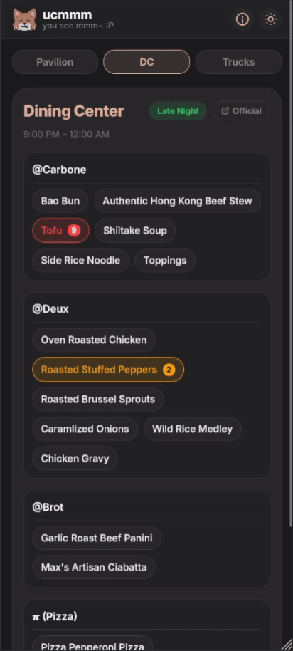
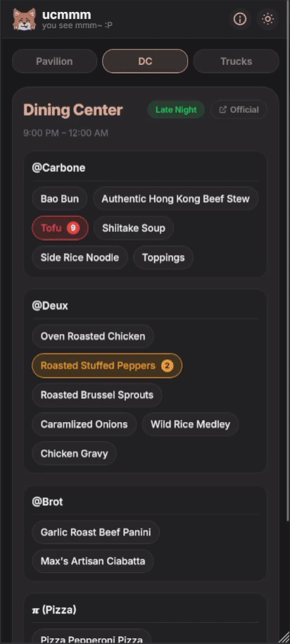
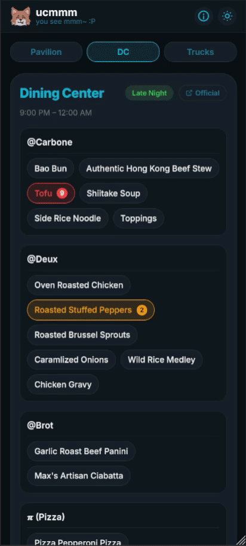

<div align="center">
  <h1><b>ucmmm</b></h1>
  <a href="https://github.com/airwuu/ucmmm/blob/main/LICENSE"></a>
  <a href="https://github.com/airwuu/ucmmm/stargazers"></a>
  <a href="https://github.com/airwuu/ucmmm"></a>
</div>
<div align="center">
    <a href="" target="_blank">
        
    </a>
</div>


## About

ucmmm is an open-source alternative menu website that aims to provide students a better user experience. Swipe between multiple dining options and view everything in just a few seconds.

Core features:

| ucmmm | original menu site |
|---------|-------------|
| `Crowd-sourced reporting on missing items` | Food items running out and not knowing |
| `Automatically selects the current date/time` | Manually selecting the time and day |
| `Itemized menu per station` | Long verbose paragraphs per station |
| `Centralized website with EVERYTHING` | Separate websites for each dining option |
|`UI for browsing Food Trucks`| Photos of schedules on spreadsheets|
|`Bonus: Customizable themes!`| Only one (blindingly bright) light mode|

## Feature Demos

<details>
<summary><b>📱 All Dining Options in One Place (v2)</b></summary>
<br>

<p>Swipe between Pavilion, Dining Center, and Food Trucks – all in one app.</p>
</details>

<details>
<summary><b>📝 Crowd-Sourced Reporting (v2)</b></summary>
<br>

<p>Tap any item to report it as missing. Help fellow students know what's actually available.</p>
</details>

<details>
<summary><b>🚚 Food Truck Schedule (v2)</b></summary>
<br>

<p>Browse the weekly food truck schedule with an easy-to-read UI.</p>
</details>

<details>
<summary><b>🎨 Preset Themes (v2)</b></summary>
<br>

<p>Choose from 8+ built-in themes to match your style.</p>
</details>

<details>
<summary><b>🖌️ Customizable Themes (v2)</b></summary>
<br>

<p>Create your own custom color scheme with the theme editor.</p>
</details>


<details open>
<summary> <b> Comparison against official menu site (v1)</b> </summary>
<br>
  Here is a simple speed demo of <b>ucmmm-v1</b> vs the official menu site, where a user wants to see what is offered at the Dining Center and Pavilion on a <b>Friday Night Dinner</b> before committing to a location.
  <br>
  <br>
  
  <h4>Left side (ucmmm):</h4>
  <ul>
    <li> ucmmm allows you to compare both menus in under 7 seconds without any clicks</li>
    <li> provides options for light and dark theme</li>
    <li> crowdsourcing by reporting missing items</li>
  </ul>
 <h4>Right side (official):</h4>
  <ul>
    <li>23 seconds and 9 clicks to view both menus. That is assuming you can scan those paragraphs at lightning speed</li>
  </ul>
</details>
<!-- <details>
<summary> <h3> More info </h3> </summary>
<br>
  

</details> -->

## Getting Started

### Frontend v2 (Active Development)

```bash
cd frontend-v2
npm install
npm run dev
```

See [frontend-v2/README.md](frontend-v2/README.md) for detailed documentation.

## Project Structure

```
ucmmm/
├── frontend-v1/    # Legacy Next.js frontend (archived for reference)
├── frontend-v2/    # Active Vite + React frontend
├── CONTRIBUTING.md # Contribution guidelines
└── README.md
```

## Future Plans
ucmmm is still under active development by UCM students. There are still plenty of features we have planned to add! 

### Feature checklist

- [x] Dynamically display menu items
- [x] Crowd sourced reporting
- [ ] Scheduled cron jobs to populate DB
- [ ] Add crowd sourced menu items
- [ ] View multiple days/meal services
- [x] Display Food trucks (OCR-powered schedule extraction)
- [ ] Allergen Information
- [x] Line Size Estimations
- [ ] Ice Machine Detection
- [x] Theme Picker/customizer

## Contributing

We welcome contributions from everyone! See [CONTRIBUTING.md](CONTRIBUTING.md) for guidelines on how to get started.
